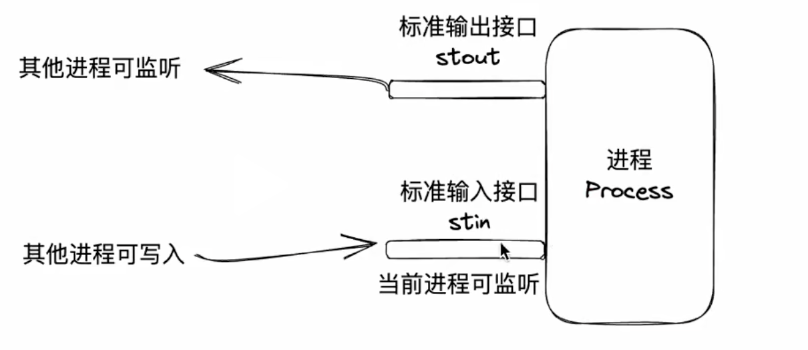
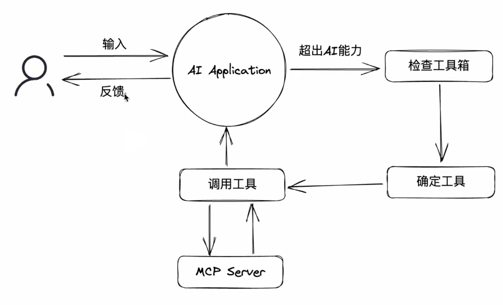

# MCP

## 定义
**MCP是一套标准协议，规定了应用程序之前如何通信**

* 如何通信
	* 	stdio(standard input and output)：推荐、高效、简洁、本地
	
	*	http：可以远程
* 通信格式：基于JSON-RPC的进一步规范
* 官网地址：`https://modelcontextprotocol.io/docs/getting-started/intro`

## 初始化JSON-RPC格式
* request
```javascript
	{
	  "jsonrpc": "2.0",           // JSON-RPC协议版本，固定为"2.0"
	  "method": "calculateMath",  // 要调用的方法名
	  "params": {                 // 参数（可以是对象、数组或单个值）
	    "operation": "add",       // 操作类型
	    "numbers": [5, 3, 2],     // 要计算的数字数组
	    "precision": 2,          // 结果精度
	    "enableRounding": true    // 是否启用四舍五入
	  },
	  "id": 12345               // 请求ID，用于匹配响应
	}
```
* response
```javascript
	{
	  "jsonrpc": "2.0",         // JSON-RPC协议版本
	  "result": {               // 方法调用结果
	    "operation": "add",     // 执行的操作
	    "inputNumbers": [5, 3, 2],
	    "result": 10.0,         // 计算结果
	    "precision": 2,
	    "rounded": true         // 是否经过了四舍五入
	  },
	  "id": 12345              // 与请求对应的ID
	}
```

## 创建一个MCP最简单的应用
* node原生创建加法应用
	```javascript
	
		const readline = require('readline');
		
		// 设置 stdin 为非暂停模式，并以行为单位读取
		const rl = readline.createInterface({
		    input: process.stdin,
		    output: process.stdout,
		    terminal: false
		});
		
		// 数学计算函数
		function calculateMath(params) {
		    const { operation, numbers, precision = 10, enableRounding = false } = params;
		
		    if (!Array.isArray(numbers) || numbers.length === 0) {
		        throw new Error('params.numbers must be a non-empty array');
		    }
		
		    let result;
		    switch (operation) {
		        case 'add':
		        result = numbers.reduce((a, b) => a + b, 0);
		        break;
		        case 'subtract':
		        result = numbers.reduce((a, b) => a - b);
		        break;
		        case 'multiply':
		        result = numbers.reduce((a, b) => a * b, 1);
		        break;
		        case 'divide':
		        result = numbers.reduce((a, b) => {
		            if (b === 0) throw new Error('Division by zero');
		            return a / b;
		        });
		        break;
		        default:
		        throw new Error(`Unsupported operation: ${operation}`);
		    }
		
		    // 应用精度和四舍五入
		    const factor = Math.pow(10, precision);
		    if (enableRounding) {
		        result = Math.round(result * factor) / factor;
		    } else {
		        // 截断到指定小数位（不四舍五入）
		        result = Math.floor(result * factor) / factor;
		    }
		
		    return result;
		}
		
		// 处理单个 JSON-RPC 请求
		function handleRequest(request) {
		    try {
		        if (request.jsonrpc !== '2.0') {
		        return { jsonrpc: '2.0', error: { code: -32600, message: 'Invalid Request' }, id: request.id ?? null };
		        }
		
		        if (request.method === 'calculateMath') {
		        const result = calculateMath(request.params);
		        return { jsonrpc: '2.0', result, id: request.id };
		        } else {
		        return { jsonrpc: '2.0', error: { code: -32601, message: 'Method not found' }, id: request.id ?? null };
		        }
		    } catch (err) {
		        return {
		        jsonrpc: '2.0',
		        error: {
		            code: -32603, // Internal error
		            message: err.message || 'Internal error'
		        },
		        id: request.id ?? null
		        };
		    }
		}
		// 监听每一行输入（假设每行是一个完整的 JSON-RPC 请求）
		rl.on('line', (line) => {
		    if (!line.trim()) return;
		
		    try {
		        const request = JSON.parse(line);
		        const response = handleRequest(request);
		        // 输出响应到 stdout（MCP 要求每条消息是独立的 JSON 行）
		        console.log(JSON.stringify(response));
		    } catch (parseErr) {
		        // JSON 解析失败
		        console.log(JSON.stringify({
		        jsonrpc: '2.0',
		        error: { code: -32700, message: 'Parse error' },
		        id: null
		        }));
		    }
		    });
		
		    // 可选：监听关闭事件（MCP 客户端可能发送 EOF）
		    rl.on('close', () => {
		    process.exit(0);
		});
	```
* 在终端中输入`npm start`启动项目
* 输入标准的JSON-RPC request格式（不要带空格）
	*	`{"jsonrpc":"2.0","method":"calculateMath","params":{"operation":"multiply","numbers":[2,3,4],"precision":1,"enableRounding":false},"id":100}`
* 返回标准的JSON-RPC response格式
	*	`{"jsonrpc":"2.0","result":24,"id":100}` 

## 工具（tools/list）	
* 创建工具合集server.js
	```javascript
	
		const readline = require('readline');
		
		const rl = readline.createInterface({
		  input: process.stdin,
		  output: process.stdout,
		  terminal: false
		});
		
		// 工具定义（保持不变）
		const TOOLS = [
		  {
		    name: "calculateMath",
		    description: "Perform basic math operations and return result in standard content format.",
		    inputSchema: {
		      type: "object",
		      properties: {
		        operation: {
		          type: "string",
		          enum: ["add", "subtract", "multiply", "divide"],
		          description: "The math operation to perform"
		        },
		        numbers: {
		          type: "array",
		          items: { type: "number" },
		          minItems: 1,
		          description: "List of numbers"
		        },
		        precision: {
		          type: "integer",
		          minimum: 0,
		          default: 10,
		          description: "Decimal places"
		        },
		        enableRounding: {
		          type: "boolean",
		          default: true,
		          description: "Enable rounding"
		        }
		      },
		      required: ["operation", "numbers"]
		    }
		  }
		];
		
		// 执行计算并返回标准 content 格式
		function runCalculateMath(params) {
		  const { operation, numbers, precision = 10, enableRounding = true } = params;
		
		  if (!Array.isArray(numbers) || numbers.length === 0) {
		    throw new Error('numbers must be a non-empty array');
		  }
		
		  let result;
		  let opSymbol;
		  switch (operation) {
		    case 'add':
		      result = numbers.reduce((a, b) => a + b, 0);
		      opSymbol = '+';
		      break;
		    case 'subtract':
		      result = numbers.reduce((a, b) => a - b);
		      opSymbol = '-';
		      break;
		    case 'multiply':
		      result = numbers.reduce((a, b) => a * b, 1);
		      opSymbol = '×';
		      break;
		    case 'divide':
		      result = numbers.reduce((a, b) => {
		        if (b === 0) throw new Error('Division by zero');
		        return a / b;
		      });
		      opSymbol = '÷';
		      break;
		    default:
		      throw new Error(`Unsupported operation: ${operation}`);
		  }
		
		  const factor = Math.pow(10, precision);
		  if (enableRounding) {
		    result = Math.round(result * factor) / factor;
		  } else {
		    result = Math.floor(result * factor) / factor;
		  }
		
		  // 构建表达式字符串（可选，用于增强展示）
		  const expression = numbers.join(` ${opSymbol} `);
		  
		  // 返回固定格式：content 数组
		  return {
		    content: [
		      {
		        type: "text",
		        text: String(result)
		      },
		      // 可选：添加第二项，比如说明
		      // {
		      //   type: "text",
		      //   text: `计算过程: ${expression} = ${result}`
		      // }
		    ]
		  };
		}
		
		// 处理 callTool
		function handleCallTool(params) {
		  const { name, arguments: args } = params;
		  if (name === 'calculateMath') {
		    return runCalculateMath(args);
		  } else {
		    throw new Error(`Tool "${name}" not found`);
		  }
		}
		
		// 处理所有 JSON-RPC 方法
		function handleRequest(request) {
		  try {
		    if (request.jsonrpc !== '2.0') {
		      return { jsonrpc: '2.0', error: { code: -32600, message: 'Invalid Request' }, id: request.id ?? null };
		    }
		
		    switch (request.method) {
		      case 'initialize':
		        return {
		          jsonrpc: '2.0',
		          result: { protocolVersion: '2024-11-05' },
		          id: request.id
		        };
		
		      case 'listTools':
		        return {
		          jsonrpc: '2.0',
		          result: { tools: TOOLS },
		          id: request.id
		        };
		
		      case 'callTool':
		        const toolResult = handleCallTool(request.params);
		        return {
		          jsonrpc: '2.0',
		          result: toolResult, // 已经是 { content: [...] } 格式
		          id: request.id
		        };
		
		      default:
		        return {
		          jsonrpc: '2.0',
		          error: { code: -32601, message: 'Method not found' },
		          id: request.id ?? null
		        };
		    }
		  } catch (err) {
		    return {
		      jsonrpc: '2.0',
		      error: {
		        code: -32603,
		        message: err.message || 'Internal error'
		      },
		      id: request.id ?? null
		    };
		  }
		}
		
		// 主循环
		rl.on('line', (line) => {
		  if (!line.trim()) return;
		  try {
		    const req = JSON.parse(line);
		    const res = handleRequest(req);
		    console.log(JSON.stringify(res));
		  } catch (e) {
		    console.log(JSON.stringify({
		      jsonrpc: '2.0',
		      error: { code: -32700, message: 'Parse error' },
		      id: null
		    }));
		  }
		});
		
		rl.on('close', () => process.exit(0));
	```
* 输入标准的JSON-RPC reuqest请求格式（不带空格）
	* `{"jsonrpc":"2.0","method":"callTool","params":{"name":"calculateMath","arguments":{"operation":"add","numbers":[5,3,2],"precision":2,"enableRounding":true}},"id":2}` 工具发现协议
*  返回标准的JSON-RPC reponse请求格式
	* `{"jsonrpc":"2.0","result":{"result":10},"id":2}`

## MCP Server调试工具
* `npx @modelcontextprotocol/inspector`
* 打开一个站点充当客户端
* Transport Type选择STDIO
* Command选择node
* Arguments选择相对于当前启动的工具目录下的服务server.js

## MCP SDK
* `npx install @modelcontextprotocol/sdk`
* 创建两个工具函数，返回标准的JSON-RPC格式
```javascript
	import { McpServer } from '@modelcontextprotocol/sdk/server/mcp.js';
	import { StdioServerTransport } from '@modelcontextprotocol/sdk/server/stdio.js';
	import { z } from 'zod'; // 数据类型校验
	import fs from 'fs';
	import path from 'path';

	// 创建 MCP 服务器
	const server = new McpServer({
		name: 'my-mcp-server',
		title: 'My MCP Server',
		version: '0.1.0'
	});

	// ========================
	// 工具 1: calculateMath
	// ========================
	const CalculateMathInputSchema = z.object({
		operation: z.enum(['add', 'subtract', 'multiply', 'divide'], {
			description: '数学操作类型'
		}),
		numbers: z.array(z.number()).min(1, '至少需要一个数字'),
		precision: z.number().int().min(0).default(10),
		enableRounding: z.boolean().default(true)
	});

	server.registerTool(
		'calculateMath',
		{
			description: '对一组数字执行加、减、乘、除运算',
			inputSchema: CalculateMathInputSchema
		},
		async (input) => {
			const { operation, numbers, precision, enableRounding } = input;

			// 执行计算
			let result;
			switch (operation) {
				case 'add':
					result = numbers.reduce((a, b) => a + b, 0);
					break;
				case 'subtract':
					result = numbers.reduce((a, b) => a - b);
					break;
				case 'multiply':
					result = numbers.reduce((a, b) => a * b, 1);
					break;
				case 'divide':
					result = numbers.reduce((a, b) => {
						if (b === 0) throw new Error('Division by zero');
						return a / b;
					});
					break;
				default:
					throw new Error(`Unsupported operation: ${operation}`);
			}

			// 应用精度
			const factor = Math.pow(10, precision);
			if (enableRounding) {
				result = Math.round(result * factor) / factor;
			} else {
				result = Math.floor(result * factor) / factor;
			}

			// 返回标准 content 格式
			return {
				content: [
					{
						type: 'text',
						text: String(result)
					}
				]
			};
		}
	);

	// ========================
	// 工具 2: createFile
	// ========================
	const CreateFileInputSchema = z.object({
		filePath: z.string().min(1, '文件路径不能为空'),
		content: z.string().optional().default('')
	});

	server.registerTool(
		'createFile',
		{
			description: '在指定路径创建一个新文件',
			inputSchema: CreateFileInputSchema
		},
		async (input) => {
			const { filePath, content } = input;

			// 确保目录存在
			const dir = path.dirname(filePath);
			if (!fs.existsSync(dir)) {
				fs.mkdirSync(dir, { recursive: true });
			}

			// 写入文件
			fs.writeFileSync(filePath, content, 'utf8');

			return {
				content: [
					{
						type: 'text',
						text: `✅ 文件已创建: ${filePath}`
					}
				]
			};
		}
	);

	// 启动服务
	const transport = new StdioServerTransport();
	server.connect(transport);
```

* `npx @modelcontextprotocol/inspector`启动调试服务

## 在AI应用程序中使用
* 常见的AI应用程序
	* ChatGPT
	* DeepSeek
	* Claude Desktop
	* vscode/cursor
* 使用cursor配置mcp应用程序

* MCP原理


## 重新认识MCP
* **MCP，全程Model Context Protocal，模型上下文协议。为AI应用程序与外部程序之间建立通信标准，从而使得外部程序可以被部署到任意的AI上，AI应用程序也可以任意的外部程序**