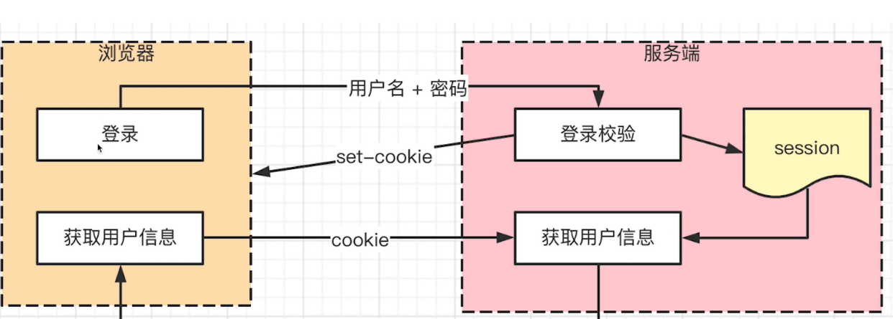
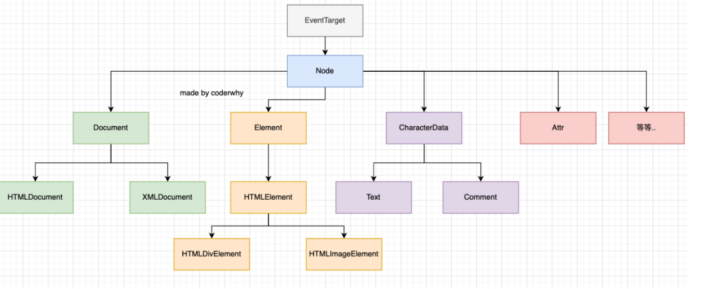
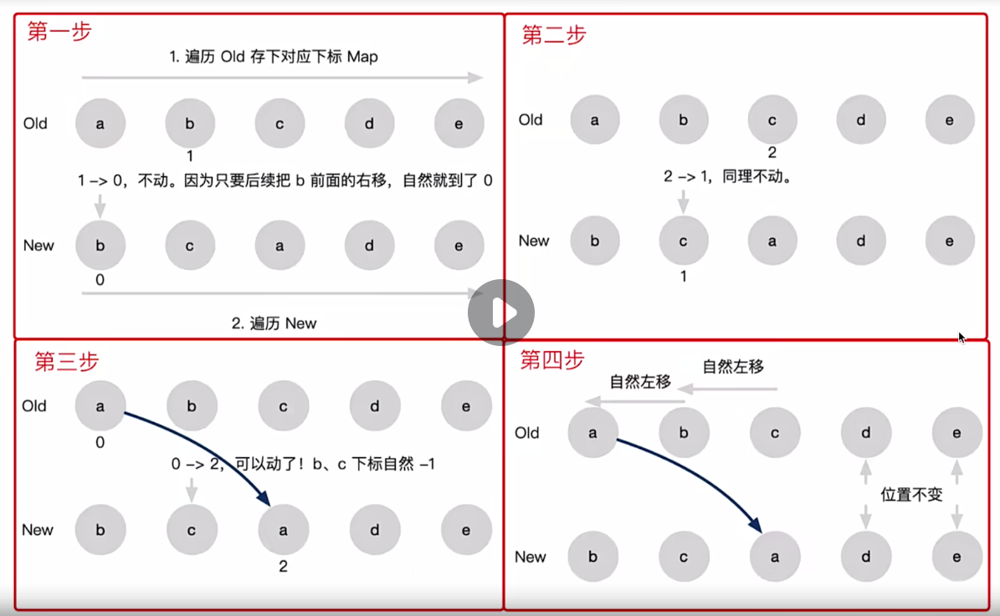
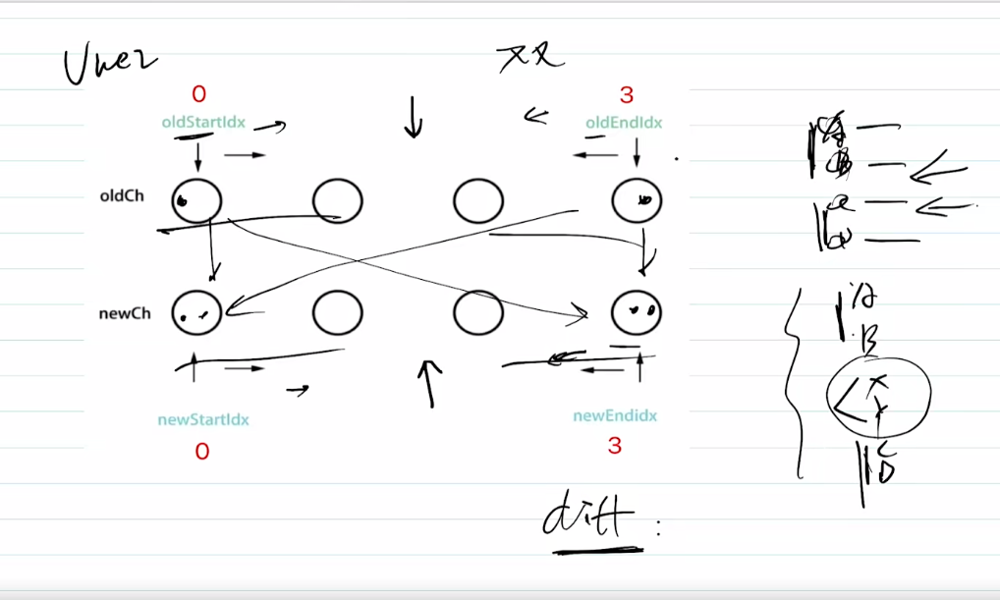
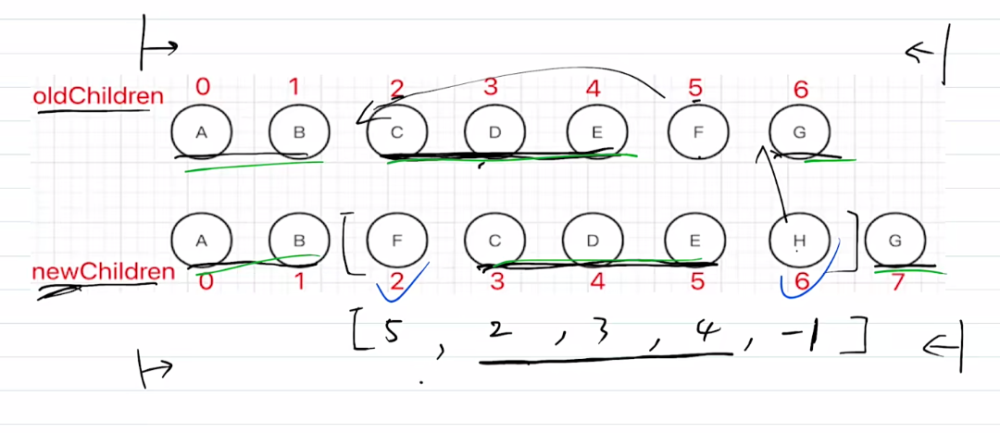

## HTTP常见面试题

### HTTP实现登录验证，有哪些方案

#### Cookie 
* HTTP无状态，每次请求必须携带cookie验证身份
* 服务端可以向客户端set Cookie，限制大小4kb
* cookie不跨域共享
* 禁止网页引入第三方的cookie
* 打击第三方广告，保护用户隐私
* 我们**一般都会将Session的Id保存到Cookie中，当服务端收到请求后，通过验证 Cookie 中的信息来判断用户是否登录**

#### cookie和session
* cookie用于登录验证，存储用户标志(如useId)
* session在服务端，存储用户的详细信息，和cookie信息一一对应
* cookie+sesiion是常见的验证登录方案



##### 跨域Session
* 即跨域cookie，服务端需要设置
```javascript
    Access-Control-Allow-Credentials: true
    Access-Control-Allow-Origin: [特定域名] //不能是*
```
* 客户端需要设置
```javascript
    //XMLHttpRequest发送请求时
    withCredentials = true
    //fetch发送请求时
    credentials = include
```

##### 问题
    1. 由于服务器端需要对接大量的客户端，也就需要存放大量的 SessionId，这样会导致服务器压力过大。
    2. 如果服务器端是一个集群，为了同步登录态，需要将 SessionId 同步到每一台机器上，无形中增加了服务器端维护成本。
    3. 由于 SessionId 存放在 Cookie 中，所以无法避免 CSRF 攻击

#### Token登录
* Token是通过服务端生成的一串字符串，以作为客户端请求的一个令牌。第一次登陆后，服务器会返回一个Token并返回给客户端，客户端后续访问时，只需要带上这个Token即可以完成身份认证。
  
##### Token生成方式
* 使用JWT(Json Web Token)，它是一种简洁的、自包含的方法，用于通信双方之间以JSON的方式安全的传递信息。使用Token后，服务器不会存储Token，Token通过多种算法拼接组合成的字符串。
* JWT主要分为三个部分：header(头信息)，payload(消息体)，signature(签名)
  1. header指定了该JWT的签名算法
  2. payload部分表明了JWT的意图
     1. signature部分为JWT的签名，不能让JWT随意的修改

###### 优缺点
1. 服务器端不需要存放 Token，所以不会对服务器端造成压力，即使是服务器集群，也不需要增加维护成本。
2. Token 可以存放在前端任何地方，可以不用保存在 Cookie 中，提升了页面的安全性。
3. Token 下发之后，只要在生效时间之内，就一直有效，但是如果服务器端想收回此 Token 的权限，并不容易。

#### SSO单点登录
* cookie默认不可跨域共享
* 主域名相同，如www.baidu.com img.baidu.com
* 设置cookie domain为主域名，即可共享cookie

* 主域名不相同，则使用SSO单点登录

### Ajax、Fetch、Axios三者区别(三个维度)
* Ajax(Asynchronous Javascript and XML)，一种技术统称
```javascript
    function ajax1(url, successFn) {
        const xhr = new XMLHttpRequest()
        xhr.open("GET", url, false)
        xhr.onreadystatechange = function() {
            if(xhr.readyState == 4) {
                if(xhr.status == 200) {
                    successFn(xht.responseText)
                }
            }
        }
    }
```

* Fetch一种浏览器原生API，用于网络请求，支持Promise
```javascript
    function ajax2(url) {
        return fetch(url).then(res => res.json())
    }
```

* Axios是一个第三方库

### 防抖和节流
#### debounce(基本实现)
```javascript
    function myDebounce(fn, delay = 200) {
        //1.设置闭包变量，记录上一次的值
        let timer = null

        const _debounce = function(...args) {
            //2.如果再次触发事件，那么取消上一次的事件  
            if (timer) clearTimeout(timer)

            //3.延迟执行对应的fn函数
            timer = setTimeout(() => {
                fn.apply(this, args)
                timer = null
            }, delay)
        }

        //4. 给_debounce绑定一个取消的函数
        _debounce.cancel =  function() {
            if (timer) clearTimeout(timer)
        }

        return _debounce
    }
```

#### throttle(基本实现)
```javascript
    function myThrottle(fn, interval = 300, immediate = true) {
        let startTime = 0
        let timer = null
        const _throttle = function(...args) {
                const nowTime = new Date().getTime()
                    //立即执行的控制
                if (!immediate && startTime == 0) {
                    startTime = nowTime
                }

                const waitTime = interval - (nowTime - startTime)
                if (waitTime < 0) {
                    if (timer) clearTimeout(timer)
                    fn.apply(this, args)
                    startTime = nowTime
                    timer = null
                }
            }
            //绑定取消的函数
        _throttle.cancel = function() {
            if (timer) clearTimeout(timer)
        }
        return _throttle
    }
```

### px % em rem vw/vh区别
* px是绝对单位，其他是相对单位
* em是相对于当前元素的font-size
* rem是相对于根元素的font-size
* vx屏幕宽度的1%
* vh屏幕高度的1%
* vminl两者的最小值，vmax两者的最大值

### 简述TCP三次握手和四次挥手
* 先建立连接(确保双方都有收发消息的能力)
* 再传输内容(如发送一个get请求)
* 网络连接是TCP协议，传输内容是HTTP协议
  
#### 三次握手，建立连接
* Client发包，Sever接收。Sever：有Client叫我
* Sever发包，Client接收。Client: Sever已经接收到信息
* Client发包，Sever接收。Sever: Client准备发送了

#### 四次挥手，断开连接
* Client发包，Sever接收。Client：请求发送完毕
* Sever发包，Client接收。Sever：Sever已收到，数据继续传输   
* Sever发包，Client接收。Sever：数据发送完毕，Sever可以断开连接
* Client发包，Sever接收。Client：数据已经收到，Sever可以断开连接(关闭连接)

### for...of和for...in的区别
* for...of适用于遍历可迭代对象，如数组、字符串、Map、Set、generator，得到value
* for...in适用于遍历可枚举数据，如对象、数组、字符串，得到key

#### 可枚举(emumerable)和可迭代(iterator)
* 可枚举类型可以通过`Object.getOwnPropertyDescriptors(oj)`查看
* 可迭代类型可以通过`arr[Symbol.iterator]()`查看

### for...await...of有什么区别
* for...await...of 用于遍历Promise

### offsetHeight和scrollHeight的区别 
* clientHeight: padding + content
* scrollHeihgt: padding + 实际内容尺寸

### HTMLCollection和NodeList区别
* 即Node和Element的关系，Node包含Element



### 跨域请求时为何需要发送option的请求
* options请求，是跨域请求之前的预检查(看服务端是否支持某个请求方法: POST|DELETE|GET|POST|PUT|PATCH)
* 浏览器自行发起，无需干预
* 不会影响实际的功能

#### 跨域请求
* 浏览器的同源策略 
* 同源策略一般限制Ajax请求，不能跨域请求server
* 不会限制<link><script><iframe>加载三方资源 
  
#### 跨域请求的几种方式
##### JSONP
1. 客户端
   1. 定义获取数据调用的回调函数
   2. 动态生成对服务端JS进行引用的代码
    * 设置url为提供jsonp服务的url地址，并在该url中设置相关callback参数
    * 创建script标签，并设置其src属性
    * 把script标签加入head，此时调用开始
2. 服务端
* 将客户端发送的callback参数作为函数名来包裹住JSON数据，返回数据至客户端。

#### CORS
* `response.setHeader("Access-Control-Allow-Origin","http://localhost:8001")`或*
* `response.setHeader("Access-Control-Allow-Header","X-Requested-with")`
* `response.setHeader("Access-Control-Allow-Methods","PUT,POST,DELETE,OPTIONS")`
* `response.setHeader("Access-Control-Allow-Credentials","true")`允许跨域接收cookie    

### JS内存泄漏如何检测？有哪些场景？
* 比如闭包，内部的函数或方法引用着作用域外部变量
#### 标记清理
* 定期遍历window中的所有，找不到的清除

#### 引用计数
```javascript
 let a = { 'x': 100}//此时引用计数为0
 let a1 = a
 a = 100
 a1 = null

 //问题：循环引用无法清除
 const obj1 = {}
 const obj2 = {}
 obj1.a = obj2
 obj2.b = obj1

 //例如IE6-7内存泄漏的bug
 var div1 = document.getElementById('div1')
 div1.a = div1
 div1.someData = {}
```

#### performance调试
* 检测js的内存泄漏

#### 场景
* 被全局变量、函数引用，组件销毁时为清除
* 被全局事件引用、定时器引用，组件销毁时未清除
* 被自定义事件引用，组件销毁时未清除

### 浏览器鹤nodejs的事件循环有什么区别
#### 单线程和异步
* JS是单线程
* 浏览器中JS执行和DOM渲染共用一个线程
* 异步是解决单线程的方案

#### 宏任务和微任务
* 宏任务：setTimeout、setInterval、Ajax
* 微任务：Promise、async/await
* 微任务在下一轮DOM渲染之前执行，宏任务在之后执行

#### nodejs中的事件循环
* 分为六大类型和优先级不同


### 虚拟DOM(vdom)
* 数据驱动视图
* data变化
* diff算法
* 更新DOM

### for和foreach那个快？

### nodejs如何开启多进程
* 线程process：计算机已经运行的程序，是操作系统管理程序的一种方式
* 进程thread：操作系统能够运行运算调度的最小单位，通常情况下它被包含在进程中
```javascript
const http = require('http')
const cpuCoreLength = require('os').cpus().length
const cluster = require('cluster')

if (cluster.isMaster) {
    for (let i = 0; i < cpuCoreLength; i++) {
        cluster.fork() //开启子进程
    }
    cluster.on('exit', worker => {
        console.log("子进程退出")
        cluster.fork() //进程守护
    })
} else { //多个子进程会共享一个TCP连接，提供一个网络服务
    const server = http.createServer((req, res) => {
        res.writeHead(200)
        res.end('done')
    })
    server.listen(3000)
}
```

### js-bridge实现原理
* 注册全局PAPI
* URL Scheme    

### requestIdleCallback和requestAnimationFrame
#### React fiber引起的关注
* 组件树转换为链表，可分段渲染
* 渲染时可以暂停，先去执行其他的高优任务，空闲时继续渲染
* 如何判断空闲 —— requestIdleCallback

#### 区别(等待DOM渲染完成后才执行是宏任务)
* requestAnimationFrame每次渲染都会执行，高优
* requestIdleCallback空闲时执行，低优

### Vue2 Vue3 React三者的diff算法有何不同？
#### diff算法的优化
* 只比较同一层级，不跨级比较
* tag不同则删除重建，不去比较内部的细节
* 优化后的时间复杂度O(n)
  
#### 三者的不同
##### React diff
* 仅右移


##### Vue2 diff
* 定义四个指针，互相比较


##### Vue3 diff
* 最长递增子序列，找出最长的递增子序列，不用拆散


#### Vue React为何循环必须使用key
* vdom diff算法会根据key判断元素是否会删除
* 匹配到了key，只需要移动元素，性能比较好
* 未匹配到key，需要删除元素重建，性能较差

### 移动端H5 300s延迟
* width = device-width做了优化，故不需要使用FastClick等库

### HTTP协议和UDP协议有什么区别
* HTTP协议在应用层
* TCP UDP协议在传输层
* 本质是TCP和UDP有什么不同
 1. TCP有连接(三次握手、四次挥手)，稳定传输
 2. UDP无连接、无断开，效率高
 3. 应用视频电话、语音通话(native)
 4. HTTP是应用层，TCP/UDP是传输层

### HTTP协议1.0/1.1/2.0区别
#### HTTP1.0
* 最基础的HTTP协议
* 支持基本
 
#### HTTP1.1
* 增加了缓存策略cache-control E-tag等
* 支持长连接Connection:keep-alive，一次TCP连接多次请求
* 支持断点续传，状态码206
* 支持新的方法PUT DELETE等，可用于Restful API

#### HTTP2.0
* 支持压缩header，减少体积
* 多路复用，一次TCP连接可以多个HTTP并行请求
* 服务端推送

### 什么是HTTPS中间人攻击？如何预防
* HTTPS是加密传输，HTTP是明文传输
* HTTPS加密传输HTTP+TLS/SSL

### 从输入url到页面展示的完整的过程
1. 网络请求
  * DNS查询(得到IP)，建立TCP连接(三次握手)
  * 浏览器发起HTTP请求
  * 收到响应请求，得到HTML源码
  * 解析HTML过程中，遇到静态资源会继续发起网络请求
  * JS CSS 图片 视频等
2. 解析 
3. 渲染

### 浏览器缓存机制(HTTP缓存机制)
* 强制缓存就是向浏览器缓存查找该请求结果，并根据该结果的缓存规则来决定是否使用该缓存结果的过程，强制缓存的情况主要有三种
  1. 不存在该缓存结果和缓存标识，强制缓存失效，则直接向服务器发起请求（跟第一次发起请求一致）
  2. 存在该缓存结果和缓存标识，但该结果已失效，强制缓存失效，则使用协商缓存(暂不分析)
  3. 存在该缓存结果和缓存标识，且该结果尚未失效，强制缓存生效，直接返回该结果
* 协商缓存就是强制缓存失效后，浏览器携带缓存标识向服务器发起请求，由服务器根据缓存标识决定是否使用缓存的过程
  1. 协商缓存生效，返回304
  2. 协商缓存失效，返回200和请求结果结果
   
总结：
* 强制缓存优先于协商缓存进行，若强制缓存(Expires和Cache-Control)生效则直接使用缓存，若不生效则进行协商缓存(Last-Modified / If-Modified-Since和Etag / If-None-Match)，协商缓存由服务器决定是否使用缓存，若协商缓存失效，那么代表该请求的缓存失效，重新获取请求结果，再存入浏览器缓存中；生效则返回304，继续使用缓存，主要过程如下：

### React单向数据流
* 即Redux

### 请描述一下Koa2洋葱模型框架
* 一个简约、流行的nodejs框架
* 通过中间件组织代码
* 多个中间件以"洋葱圈模型"执行

```javascript
    
```

### 性能优化手段(五点)
* 通过CDN引入的方式引入javaScript脚本
* 打包优化
* 资源预加载
* 浏览器缓存
* 异步加载


